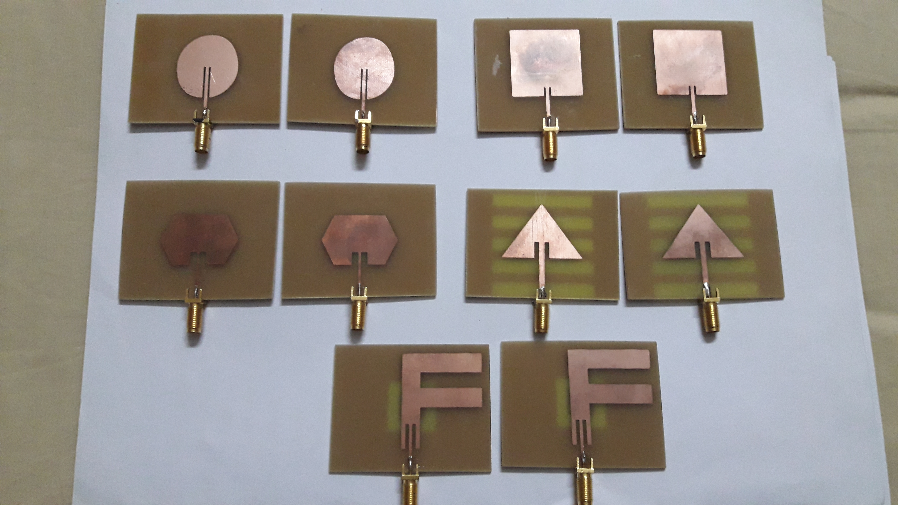
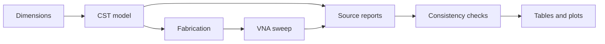
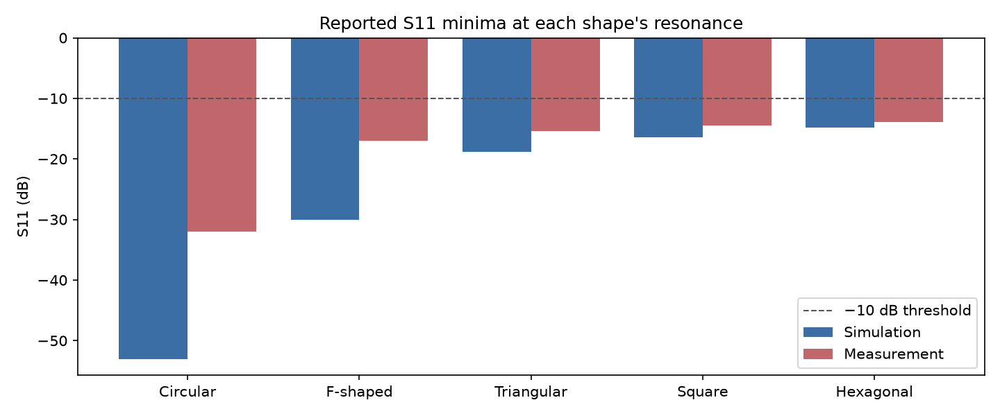
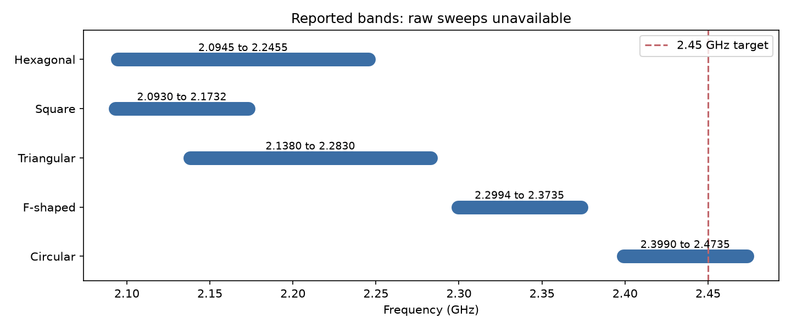

# Antenna

**2.45 GHz target · 5 patch shapes · FR4 · CST + VNA**

## Overview

Circular, F shaped, triangular, square and hexagonal copper patches: simulated, fabricated and measured.

<p align="center"></p>

### Data flow



## Results

S11 minima occur at each shape’s resonance. **Circular has the deepest reported minimum; only its reported band includes 2.45 GHz.**

<!-- BEGIN:results-table -->
| Shape | Simulated S11 (dB) | Measured S11 (dB) | Reported VSWR | VSWR from measured S11 |
|---|---|---|---|---|
| **Circular** | **−53.08** | **−31.99** | **1.125** | **1.052** |
| F-shaped | −30.02 | −16.98 | 1.167 | 1.330 |
| Triangular | −18.86 | −15.37 | 1.368 | 1.411 |
| Square | −16.38 | −14.46 | 1.536 | 1.467 |
| Hexagonal | −14.78 | −13.93 | 1.694 | 1.504 |
<!-- END:results-table -->

Reported measured VSWR disagrees with S11 in **5/5** rows. Calculated VSWR is a consistency check, not a new measurement.

<p align="center"></p>

<!-- BEGIN:bandwidth-table -->
| Shape | Reported band (GHz) | Reported BW (%) | BW from edges (%) |
|---|---|---|---|
| **Circular** | **2.3990 to 2.4735** | **3.12** | **3.06** |
| F-shaped | 2.2994 to 2.3735 | 2.98 | 3.17 |
| Triangular | 2.1380 to 2.2830 | 2.45 | 6.56 |
| Square | 2.0930 to 2.1732 | 2.41 | 3.76 |
| Hexagonal | 2.0945 to 2.2455 | 2.12 | 6.96 |
<!-- END:bandwidth-table -->

BW uses `100 × (upper − lower) / midpoint`. Source reports conflict: circular is **3.62%** on p. 6 and **3.12%** on p. 20. Raw sweeps are needed to verify all bands.

<p align="center"></p>

## Design

| Parameter | Value |
|---|---|
| Substrate | FR4; εr 4.4; loss tangent 0.02 |
| Substrate / copper thickness | 1.4 / 0.036 mm |
| Ground | 75.20 × 58.76 mm |
| Feed width / gap | 2.7 / 1 mm |
| Circular / square / hexagonal | Radius 17 / side 29.38 / side 17 mm |
| Triangle | Base 37.60; height 29.38 mm |
| F shape | 37.60 × 29.38 mm; vertical 10; bars 8; gap 3; middle 25 mm |

## Toolkit

```sh
python -m pip install -e ".[plots,dev]"
antenna check
antenna tables --check --readme README.md
python -m pytest
antenna plot --out outputs
antenna ingest path/to/trace.s1p
antenna tables --write --readme README.md
```

| Command | Output |
|---|---|
| `check` | Data validity and RF consistency |
| `ingest` | S11 minimum; VSWR; interpolated contiguous band |
| `design` / `synth` | Approximate resonance / primary dimension |
| `tables` / `plot` | Report tables / comparison figures |

Open `cst/patch-antenna.bas` in CST’s VBA editor; select `PatchShape` and run in a fresh project. The macro is a reconstruction template, not the original simulation project.

## Tech stack

| Task | Tool |
|---|---|
| Simulation / measurement | CST Studio Suite / VNA |
| Analysis / plots | Python 3.9+ / Matplotlib |
| Verification | pytest; packaged CLI |

## Limits

1. No raw CST/VNA sweeps, calibration logs or repeat measurements; source inconsistencies remain unverified.
2. Closed form models approximate the triangle, hexagon and F shape; far field magnitude is not verified measured gain.
3. Macro execution requires CST; hardware performance and 2.45 GHz suitability require new measurements.

## Sources

[Simulation](docs/simulation-and-results.pdf) · [Fabrication and measurement](docs/fabrication-and-measurement.pdf) · [Methodology](docs/methodology.pdf)

| Reference | Use |
|---|---|
| [Balanis, *Antenna Theory*, 4th ed., 2016](https://www.wiley.com/en-us/Antenna+Theory%3A+Analysis+and+Design%2C+4th+Edition-p-9781118642061) | Patch equations |
| [Garg et al., *Microstrip Antenna Design Handbook*, 2001](https://us.artechhouse.com/Microstrip-Antenna-Design-Handbook-P619.aspx) | Patch geometries |
| [Pozar, *Microstrip Antennas*, 1992](https://doi.org/10.1109/5.119568) | Radiation and design limits |
| [IBIS, Touchstone specification](https://www.ibis.org/touchstone_ver2.1/touchstone_ver2_1.pdf) | Sweep format |

[MIT License](LICENSE)
